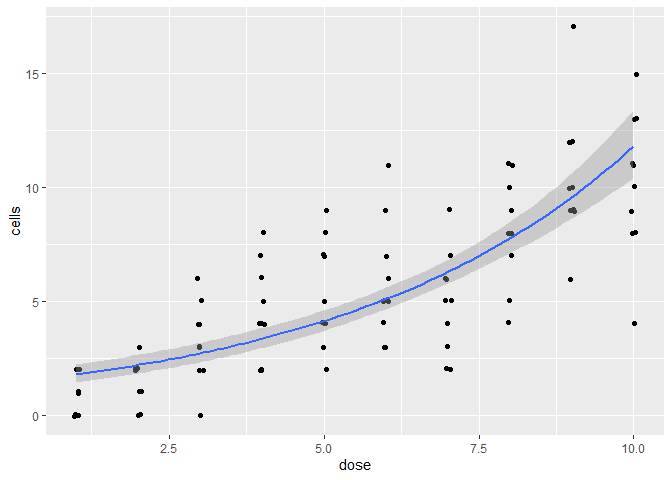
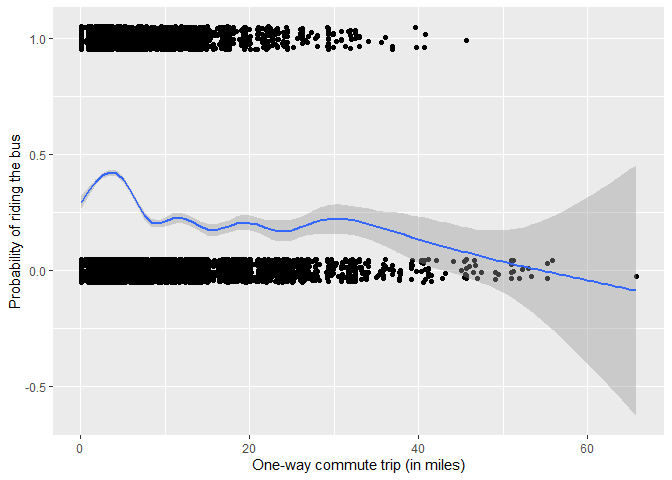
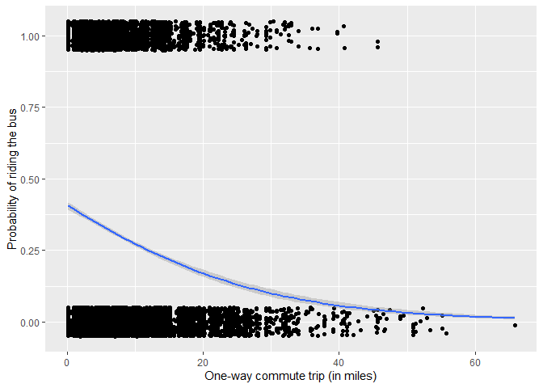
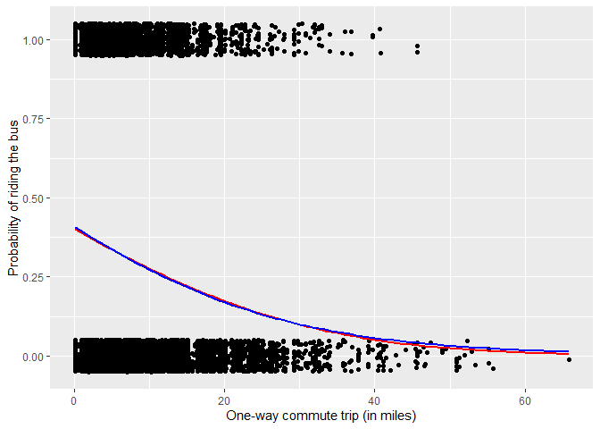
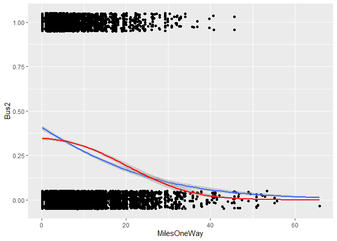

```r
#```{r, echo = FALSE, results='hide'}
# if we used both 'echo=TRUE' and 'results=hide' the pipe would not work properly
# if we used 'echo = FALSE' and 'results=hide' we would have only messages (i.e. attaching package) If we don't want them we set 'error = FALSE', 'warning = FALSE', and 'message = FALSE'.
```

## Refresher on fitting linear models


```r
# Fit a lm()
lm(formula = weight ~ Diet, data = chick_weight_end)
```

```
## 
## Call:
## lm(formula = weight ~ Diet, data = chick_weight_end)
## 
## Coefficients:
## (Intercept)        Diet2        Diet3        Diet4  
##      177.75        36.95        92.55        60.81
```

```r
# Fit a glm()
glm(formula = weight ~ Diet , data = chick_weight_end, family = 'gaussian')
```

```
## 
## Call:  glm(formula = weight ~ Diet, family = "gaussian", data = chick_weight_end)
## 
## Coefficients:
## (Intercept)        Diet2        Diet3        Diet4  
##      177.75        36.95        92.55        60.81  
## 
## Degrees of Freedom: 44 Total (i.e. Null);  41 Residual
## Null Deviance:	    225000 
## Residual Deviance: 167800 	AIC: 507.8
```

## Fitting a Poisson regression in R


```r
# fit y predicted by x with data.frame dat using the poisson family
poisson_out <- glm(count ~ time, family = "poisson", data = dat)

# print the output
summary(poisson_out)
```

```
## 
## Call:
## glm(formula = count ~ time, family = "poisson", data = dat)
## 
## Deviance Residuals: 
##     Min       1Q   Median       3Q      Max  
## -1.6547  -0.9666  -0.7226   0.3830   2.3022  
## 
## Coefficients:
##             Estimate Std. Error z value Pr(>|z|)  
## (Intercept) -1.43036    0.59004  -2.424   0.0153 *
## time         0.05815    0.02779   2.093   0.0364 *
## ---
## Signif. codes:  0 '***' 0.001 '**' 0.01 '*' 0.05 '.' 0.1 ' ' 1
## 
## (Dispersion parameter for poisson family taken to be 1)
## 
##     Null deviance: 35.627  on 29  degrees of freedom
## Residual deviance: 30.918  on 28  degrees of freedom
## AIC: 66.024
## 
## Number of Fisher Scoring iterations: 5
```

## Comparing linear and Poisson regression


```r
# Fit a glm with count predicted by time using data.frame dat and gaussian family
lm_out <- glm(count ~ time, data = dat, family = "gaussian")

summary(lm_out)
```

```
## 
## Call:
## glm(formula = count ~ time, family = "gaussian", data = dat)
## 
## Deviance Residuals: 
##     Min       1Q   Median       3Q      Max  
## -1.2022  -0.5190  -0.1497   0.2595   3.0194  
## 
## Coefficients:
##             Estimate Std. Error t value Pr(>|t|)  
## (Intercept)  0.09425    0.32891   0.287   0.7766  
## time         0.03693    0.01853   1.993   0.0561 .
## ---
## Signif. codes:  0 '***' 0.001 '**' 0.01 '*' 0.05 '.' 0.1 ' ' 1
## 
## (Dispersion parameter for gaussian family taken to be 0.7714815)
## 
##     Null deviance: 24.667  on 29  degrees of freedom
## Residual deviance: 21.601  on 28  degrees of freedom
## AIC: 81.283
## 
## Number of Fisher Scoring iterations: 2
```

```r
summary(poisson_out)
```

```
## 
## Call:
## glm(formula = count ~ time, family = "poisson", data = dat)
## 
## Deviance Residuals: 
##     Min       1Q   Median       3Q      Max  
## -1.6547  -0.9666  -0.7226   0.3830   2.3022  
## 
## Coefficients:
##             Estimate Std. Error z value Pr(>|z|)  
## (Intercept) -1.43036    0.59004  -2.424   0.0153 *
## time         0.05815    0.02779   2.093   0.0364 *
## ---
## Signif. codes:  0 '***' 0.001 '**' 0.01 '*' 0.05 '.' 0.1 ' ' 1
## 
## (Dispersion parameter for poisson family taken to be 1)
## 
##     Null deviance: 35.627  on 29  degrees of freedom
## Residual deviance: 30.918  on 28  degrees of freedom
## AIC: 66.024
## 
## Number of Fisher Scoring iterations: 5
```

## Intercepts-comparisons versus means


```r
# Fit a glm() that estimates the difference between players
summary(glm(goal ~ player, data = scores, family = 'poisson'))
```

```
## 
## Call:
## glm(formula = goal ~ player, family = "poisson", data = scores)
## 
## Deviance Residuals: 
##     Min       1Q   Median       3Q      Max  
## -2.0000  -0.6325  -0.6325   0.4934   1.2724  
## 
## Coefficients:
##             Estimate Std. Error z value Pr(>|z|)  
## (Intercept)  -1.6094     0.9999  -1.610   0.1075  
## playerSam     2.3026     1.0487   2.196   0.0281 *
## ---
## Signif. codes:  0 '***' 0.001 '**' 0.01 '*' 0.05 '.' 0.1 ' ' 1
## 
## (Dispersion parameter for poisson family taken to be 1)
## 
##     Null deviance: 18.3578  on 9  degrees of freedom
## Residual deviance:  9.8105  on 8  degrees of freedom
## AIC: 26.682
## 
## Number of Fisher Scoring iterations: 5
```

```r
# Fit a glm() that estimates an intercept for each player 
summary(glm(goal ~ player - 1, data = scores, family = 'poisson'))
```

```
## 
## Call:
## glm(formula = goal ~ player - 1, family = "poisson", data = scores)
## 
## Deviance Residuals: 
##     Min       1Q   Median       3Q      Max  
## -2.0000  -0.6325  -0.6325   0.4934   1.2724  
## 
## Coefficients:
##           Estimate Std. Error z value Pr(>|z|)  
## playerLou  -1.6094     0.9999  -1.610   0.1075  
## playerSam   0.6931     0.3162   2.192   0.0284 *
## ---
## Signif. codes:  0 '***' 0.001 '**' 0.01 '*' 0.05 '.' 0.1 ' ' 1
## 
## (Dispersion parameter for poisson family taken to be 1)
## 
##     Null deviance: 18.4546  on 10  degrees of freedom
## Residual deviance:  9.8105  on  8  degrees of freedom
## AIC: 26.682
## 
## Number of Fisher Scoring iterations: 5
```

Note that the intercept from model 1, (Intercept), is the same as Lou's coefficient from model 2, playerLou. R allows for two different types of intercepts to be estimated. The first and default setting estimated the number of goals scored by Sam and the difference in goals scored by Lou. The second setting, using - 1, estimated the number of goals scored by Sam AND the number of goals scored by Lou. More generally, the default formula in R uses the first factor level and contrasts all other levels to it. Reording a factor allows you to change the reference level.

## Applying summary(), print(), and tidy() to glm


```r
# Build your linear and Poisson regression models
lm_out <- lm(Number ~ Month, data = dat)
poisson_out <- glm(Number ~ Month, data = dat, family = 'poisson')

# Examine the outputs using print()
print(lm_out)
```

```
## 
## Call:
## lm(formula = Number ~ Month, data = dat)
## 
## Coefficients:
## (Intercept)       Month2       Month3       Month4       Month5       Month6  
##    0.129477    -0.038031    -0.078401    -0.057254    -0.032702    -0.043365  
##      Month7       Month8       Month9      Month10      Month11      Month12  
##   -0.005821    -0.051520    -0.023921    -0.054208    -0.023921    -0.022919
```

```r
print(poisson_out)
```

```
## 
## Call:  glm(formula = Number ~ Month, family = "poisson", data = dat)
## 
## Coefficients:
## (Intercept)       Month2       Month3       Month4       Month5       Month6  
##     -2.0443      -0.3478      -0.9302      -0.5838      -0.2911      -0.4079  
##      Month7       Month8       Month9      Month10      Month11      Month12  
##     -0.0460      -0.5073      -0.2043      -0.5424      -0.2043      -0.1948  
## 
## Degrees of Freedom: 4367 Total (i.e. Null);  4356 Residual
## Null Deviance:	    2325 
## Residual Deviance: 2303 	AIC: 2976
```

```r
# Examine the outputs using summary()
summary(lm_out)
```

```
## 
## Call:
## lm(formula = Number ~ Month, data = dat)
## 
## Residuals:
##     Min      1Q  Median      3Q     Max 
## -0.1295 -0.1056 -0.0914 -0.0753  8.8763 
## 
## Coefficients:
##              Estimate Std. Error t value Pr(>|t|)    
## (Intercept)  0.129477   0.022770   5.686 1.38e-08 ***
## Month2      -0.038031   0.032767  -1.161   0.2458    
## Month3      -0.078401   0.032007  -2.450   0.0143 *  
## Month4      -0.057254   0.032269  -1.774   0.0761 .  
## Month5      -0.032702   0.032007  -1.022   0.3070    
## Month6      -0.043365   0.032269  -1.344   0.1791    
## Month7      -0.005821   0.032007  -0.182   0.8557    
## Month8      -0.051520   0.032007  -1.610   0.1075    
## Month9      -0.023921   0.032269  -0.741   0.4586    
## Month10     -0.054208   0.032007  -1.694   0.0904 .  
## Month11     -0.023921   0.032269  -0.741   0.4586    
## Month12     -0.022919   0.032136  -0.713   0.4758    
## ---
## Signif. codes:  0 '***' 0.001 '**' 0.01 '*' 0.05 '.' 0.1 ' ' 1
## 
## Residual standard error: 0.4338 on 4356 degrees of freedom
## Multiple R-squared:  0.00249,	Adjusted R-squared:  -2.927e-05 
## F-statistic: 0.9884 on 11 and 4356 DF,  p-value: 0.4542
```

```r
summary(poisson_out)
```

```
## 
## Call:
## glm(formula = Number ~ Month, family = "poisson", data = dat)
## 
## Deviance Residuals: 
##     Min       1Q   Median       3Q      Max  
## -0.5089  -0.4595  -0.4277  -0.3880   7.7086  
## 
## Coefficients:
##             Estimate Std. Error z value Pr(>|z|)    
## (Intercept)  -2.0443     0.1459 -14.015  < 2e-16 ***
## Month2       -0.3478     0.2314  -1.503 0.132839    
## Month3       -0.9302     0.2719  -3.422 0.000623 ***
## Month4       -0.5837     0.2444  -2.388 0.016923 *  
## Month5       -0.2911     0.2215  -1.314 0.188706    
## Month6       -0.4079     0.2314  -1.763 0.077939 .  
## Month7       -0.0460     0.2074  -0.222 0.824486    
## Month8       -0.5073     0.2361  -2.149 0.031671 *  
## Month9       -0.2043     0.2182  -0.936 0.349112    
## Month10      -0.5424     0.2387  -2.272 0.023075 *  
## Month11      -0.2043     0.2182  -0.936 0.349112    
## Month12      -0.1948     0.2166  -0.899 0.368434    
## ---
## Signif. codes:  0 '***' 0.001 '**' 0.01 '*' 0.05 '.' 0.1 ' ' 1
## 
## (Dispersion parameter for poisson family taken to be 1)
## 
##     Null deviance: 2325.3  on 4367  degrees of freedom
## Residual deviance: 2302.7  on 4356  degrees of freedom
## AIC: 2975.6
## 
## Number of Fisher Scoring iterations: 6
```

```r
# Examine the outputs using tidy()
library(broom)
tidy(lm_out)
```

```
## # A tibble: 12 x 5
##    term        estimate std.error statistic      p.value
##    <chr>          <dbl>     <dbl>     <dbl>        <dbl>
##  1 (Intercept)  0.129      0.0228     5.69  0.0000000138
##  2 Month2      -0.0380     0.0328    -1.16  0.246       
##  3 Month3      -0.0784     0.0320    -2.45  0.0143      
##  4 Month4      -0.0573     0.0323    -1.77  0.0761      
##  5 Month5      -0.0327     0.0320    -1.02  0.307       
##  6 Month6      -0.0434     0.0323    -1.34  0.179       
##  7 Month7      -0.00582    0.0320    -0.182 0.856       
##  8 Month8      -0.0515     0.0320    -1.61  0.108       
##  9 Month9      -0.0239     0.0323    -0.741 0.459       
## 10 Month10     -0.0542     0.0320    -1.69  0.0904      
## 11 Month11     -0.0239     0.0323    -0.741 0.459       
## 12 Month12     -0.0229     0.0321    -0.713 0.476
```

```r
tidy(poisson_out)
```

```
## # A tibble: 12 x 5
##    term        estimate std.error statistic  p.value
##    <chr>          <dbl>     <dbl>     <dbl>    <dbl>
##  1 (Intercept)  -2.04       0.146   -14.0   1.27e-44
##  2 Month2       -0.348      0.231    -1.50  1.33e- 1
##  3 Month3       -0.930      0.272    -3.42  6.23e- 4
##  4 Month4       -0.584      0.244    -2.39  1.69e- 2
##  5 Month5       -0.291      0.221    -1.31  1.89e- 1
##  6 Month6       -0.408      0.231    -1.76  7.79e- 2
##  7 Month7       -0.0460     0.207    -0.222 8.24e- 1
##  8 Month8       -0.507      0.236    -2.15  3.17e- 2
##  9 Month9       -0.204      0.218    -0.936 3.49e- 1
## 10 Month10      -0.542      0.239    -2.27  2.31e- 2
## 11 Month11      -0.204      0.218    -0.936 3.49e- 1
## 12 Month12      -0.195      0.217    -0.899 3.68e- 1
```

## Extracting coefficients from glm()


```r
# Extract the regression coefficients
coef(poisson_out)
```

```
## (Intercept)      Month2      Month3      Month4      Month5      Month6 
## -2.04425523 -0.34775767 -0.93019964 -0.58375226 -0.29111968 -0.40786159 
##      Month7      Month8      Month9     Month10     Month11     Month12 
## -0.04599723 -0.50734279 -0.20426264 -0.54243411 -0.20426264 -0.19481645
```

```r
# Extract the confidence intervals
confint(poisson_out)
```

```
## Waiting for profiling to be done...
```

```
##                  2.5 %      97.5 %
## (Intercept) -2.3444432 -1.77136313
## Month2      -0.8103027  0.10063404
## Month3      -1.4866061 -0.41424128
## Month4      -1.0762364 -0.11342457
## Month5      -0.7311289  0.14051326
## Month6      -0.8704066  0.04053012
## Month7      -0.4542037  0.36161360
## Month8      -0.9807831 -0.05092540
## Month9      -0.6367321  0.22171492
## Month10     -1.0218277 -0.08165226
## Month11     -0.6367321  0.22171492
## Month12     -0.6237730  0.22851779
```

## Predicting with glm()


```r
# print the new input months
print(new_dat)
```

```
##   Month
## 1     6
## 2     7
## 3     8
```

```r
# use the model to predict with new data 
pred_out <- predict(object = poisson_out, newdata = new_dat, type = "response")

# print the predictions
print(pred_out)
```

```
##          1          2          3 
## 0.08611111 0.12365591 0.07795699
```

## Fitting a logistic regression


```r
bus<-read.csv("bus.csv")
bus$Bus<-factor(bus$Bus, levels = c("No", "Yes"))

# Build a glm using the bus data frame that models Bus predicted by CommuteDays
bus_out <- glm(Bus ~CommuteDays, data = bus, family = "binomial")
```

## Examining & interpreting logistic regression outputs


```r
# Print the bus_out (be sure to use the print function)
print(bus_out)
```

```
## 
## Call:  glm(formula = Bus ~ CommuteDays, family = "binomial", data = bus)
## 
## Coefficients:
## (Intercept)  CommuteDays  
##     -1.4549       0.1299  
## 
## Degrees of Freedom: 15891 Total (i.e. Null);  15890 Residual
## Null Deviance:	    19570 
## Residual Deviance: 19540 	AIC: 19540
```

```r
# Look at the summary of bus_out
summary(bus_out)
```

```
## 
## Call:
## glm(formula = Bus ~ CommuteDays, family = "binomial", data = bus)
## 
## Deviance Residuals: 
##     Min       1Q   Median       3Q      Max  
## -0.9560  -0.8595  -0.8595   1.5330   1.7668  
## 
## Coefficients:
##             Estimate Std. Error z value Pr(>|z|)    
## (Intercept) -1.45493    0.11471 -12.683  < 2e-16 ***
## CommuteDays  0.12985    0.02312   5.616 1.96e-08 ***
## ---
## Signif. codes:  0 '***' 0.001 '**' 0.01 '*' 0.05 '.' 0.1 ' ' 1
## 
## (Dispersion parameter for binomial family taken to be 1)
## 
##     Null deviance: 19568  on 15891  degrees of freedom
## Residual deviance: 19536  on 15890  degrees of freedom
## AIC: 19540
## 
## Number of Fisher Scoring iterations: 4
```

```r
# Look at the tidy() output of bus_out
tidy(bus_out)
```

```
## # A tibble: 2 x 5
##   term        estimate std.error statistic  p.value
##   <chr>          <dbl>     <dbl>     <dbl>    <dbl>
## 1 (Intercept)   -1.45     0.115     -12.7  7.32e-37
## 2 CommuteDays    0.130    0.0231      5.62 1.96e- 8
```

## Simulating binary data


```r
set.seed(613)

# Simulate 1 draw with a sample size of 100
binomial_sim <- rbinom(n = 1, size = 100, prob = 0.5)

# Simulate 100 draw with a sample size of 1 
bernoulli_sim <- rbinom(n = 100, size = 1, prob = 0.5)

# Print the results from the binomial
print(binomial_sim)
```

```
## [1] 45
```

```r
# Sum the results from the Bernoulli
sum(bernoulli_sim)
```

```
## [1] 50
```

## Long-form logistic regression input

directly models each observation


```r
data_long
```

```
##    x       y
## 1  a    fail
## 2  a    fail
## 3  a    fail
## 4  a    fail
## 5  a success
## 6  a    fail
## 7  a    fail
## 8  a    fail
## 9  a    fail
## 10 a    fail
## 11 a    fail
## 12 a    fail
## 13 a    fail
## 14 a success
## 15 b success
## 16 b    fail
## 17 b success
## 18 b success
## 19 b success
## 20 b success
## 21 b success
## 22 b success
## 23 b success
## 24 b success
## 25 b success
## 26 b    fail
## 27 b success
## 28 b    fail
```

```r
# Fit a a long format logistic regression
lr_1 <- glm(y ~ x, data = data_long, family = "binomial")
print(lr_1)
```

```
## 
## Call:  glm(formula = y ~ x, family = "binomial", data = data_long)
## 
## Coefficients:
## (Intercept)           xb  
##      -1.792        3.091  
## 
## Degrees of Freedom: 27 Total (i.e. Null);  26 Residual
## Null Deviance:	    38.67 
## Residual Deviance: 26.03 	AIC: 30.03
```

There are 28 entries hence the degrees of freedom are 27. This is because degrees of freedom are usually the number of data points minus the number of parameters estimated.

## Wide-form input logistic regression


```r
data_wide
```

```
##   x fail success Total successProportion
## 1 a   12       2    14         0.1428571
## 2 b    3      11    14         0.7857143
```

```r
# Fit a wide form logistic regression
lr_2 <- glm(cbind(success, fail) ~ x, family = 'binomial',
            data = data_wide)

# Print the output of lr_2
print(lr_2)
```

```
## 
## Call:  glm(formula = cbind(success, fail) ~ x, family = "binomial", 
##     data = data_wide)
## 
## Coefficients:
## (Intercept)           xb  
##      -1.792        3.091  
## 
## Degrees of Freedom: 1 Total (i.e. Null);  0 Residual
## Null Deviance:	    12.64 
## Residual Deviance: 4.441e-15 	AIC: 9.215
```

```r
# Using dataWide, fit a glm with successProportion
# predicted by x and weights = Total
lr_3 <- glm(successProportion ~ x, weights = Total, data = data_wide, family = "binomial")

# Print the output of lr_3
print(lr_3)
```

```
## 
## Call:  glm(formula = successProportion ~ x, family = "binomial", data = data_wide, 
##     weights = Total)
## 
## Coefficients:
## (Intercept)           xb  
##      -1.792        3.091  
## 
## Degrees of Freedom: 1 Total (i.e. Null);  0 Residual
## Null Deviance:	    12.64 
## Residual Deviance: 2.22e-16 	AIC: 9.215
```

While all three methods produce the same regression coefficients, notice how the degrees of freedom in model 1 differed from the degrees of freedom in models 2 and 3. In general, the degrees of freedom are greater for the long form input. The choice of model input formatting is a personal choice and is usually driven by the structure of the data and questions being asked with the data. 

## Fitting probits and logits


```r
# Fit a GLM with a logit link and save it as bus_logit
bus_logit <- glm(Bus ~ CommuteDays, data = bus, family = binomial(link = "logit"))

# Fit a GLM with probit link and save it as bus_probit
bus_probit <- glm(Bus ~ CommuteDays, data = bus, family = binomial(link = "probit"))

# Print model summaries
summary(bus_logit)
```

```
## 
## Call:
## glm(formula = Bus ~ CommuteDays, family = binomial(link = "logit"), 
##     data = bus)
## 
## Deviance Residuals: 
##     Min       1Q   Median       3Q      Max  
## -0.9560  -0.8595  -0.8595   1.5330   1.7668  
## 
## Coefficients:
##             Estimate Std. Error z value Pr(>|z|)    
## (Intercept) -1.45493    0.11471 -12.683  < 2e-16 ***
## CommuteDays  0.12985    0.02312   5.616 1.96e-08 ***
## ---
## Signif. codes:  0 '***' 0.001 '**' 0.01 '*' 0.05 '.' 0.1 ' ' 1
## 
## (Dispersion parameter for binomial family taken to be 1)
## 
##     Null deviance: 19568  on 15891  degrees of freedom
## Residual deviance: 19536  on 15890  degrees of freedom
## AIC: 19540
## 
## Number of Fisher Scoring iterations: 4
```

```r
summary(bus_probit)
```

```
## 
## Call:
## glm(formula = Bus ~ CommuteDays, family = binomial(link = "probit"), 
##     data = bus)
## 
## Deviance Residuals: 
##     Min       1Q   Median       3Q      Max  
## -0.9545  -0.8596  -0.8596   1.5328   1.7706  
## 
## Coefficients:
##             Estimate Std. Error z value Pr(>|z|)    
## (Intercept) -0.88951    0.06833 -13.017  < 2e-16 ***
## CommuteDays  0.07810    0.01380   5.658 1.53e-08 ***
## ---
## Signif. codes:  0 '***' 0.001 '**' 0.01 '*' 0.05 '.' 0.1 ' ' 1
## 
## (Dispersion parameter for binomial family taken to be 1)
## 
##     Null deviance: 19568  on 15891  degrees of freedom
## Residual deviance: 19536  on 15890  degrees of freedom
## AIC: 19540
## 
## Number of Fisher Scoring iterations: 4
```

## Simulating a logit


```r
set.seed(613)

# Convert from the logit scale to a probability
p <- plogis(0)
p
```

```
## [1] 0.5
```

```r
# Simulate a logit 
rbinom(n = 10, size = 1, p)
```

```
##  [1] 1 1 0 1 0 1 1 1 0 0
```

## Simulating a probit


```r
set.seed(613)

# Convert from the probit scale to a probability
p <- pnorm(0)
p
```

```
## [1] 0.5
```

```r
# Simulate a probit
rbinom(n = 10, size = 1, p)
```

```
##  [1] 1 1 0 1 0 1 1 1 0 0
```

## lm vs. Poisson coefficients


```r
# Extract the coeffients from lm_out
lm_coef <- coef(lm_out)
lm_coef

# Extract the coefficients from poisson_out
poisson_coef <- coef(poisson_out)
poisson_coef

# Take the exponential using exp()
poisson_coef_exp <- exp(poisson_coef)
poisson_coef_exp
```

## Poisson regression plotting


```r
library(ggplot2)

# Use geom_smooth to plot a continuous predictor variable
ggplot(data = dat, aes(x = dose, y = cells)) + 
	geom_jitter(width = 0.05, height = 0.05) + 
	geom_smooth(method = 'glm', method.args = list(family = 'poisson'))
```

```
## `geom_smooth()` using formula 'y ~ x'
```

<!-- -->

## Extracting and interpreting odds-ratios (for logistic regression)


```r
# Extract out the coefficients 
coef_out <- coef(bus_out)

# Convert the coefficients to odds-ratios 
exp(coef_out)
```

## Odds-ratios & confidence intervals in the Tidyverse


```r
# Exponentiate the results and extract the confidence intervals of bus_out with tidy()
tidy(bus_out, exponentiate = TRUE, conf.int = TRUE)
```

## Default trend lines


```r
bus$Bus2<-ifelse(bus$Bus=="Yes", 1, 0)
head(bus)
```

```
##   CommuteDays MilesOneWay Bus Bus2
## 1           5    19.54675 Yes    1
## 2           5    19.54675 Yes    1
## 3           5    19.54675 Yes    1
## 4           5    19.54675 Yes    1
## 5           3    19.54675 Yes    1
## 6           4    21.66784 Yes    1
```

```r
# Create a jittered plot of MilesOneWay vs Bus2 using the bus dataset
gg_jitter <- ggplot(data = bus, aes(x = MilesOneWay, y = Bus2)) + 
	geom_jitter(width = 0, height = 0.05) +
	ylab("Probability of riding the bus") +
	xlab("One-way commute trip (in miles)")

# Add a geom_smooth() to your plot
gg_jitter + geom_smooth()
```

```
## `geom_smooth()` using method = 'gam' and formula 'y ~ s(x, bs = "cs")'
```

<!-- -->

This does not look reasonable! We need to use the `"glm"` method.


```r
# Create a jittered plot of MilesOneWay vs Bus2 using the bus dataset
gg_jitter <- ggplot(data = bus, aes(x = MilesOneWay, y = Bus2)) + 
	geom_jitter(width = 0, height = 0.05) +
	ylab("Probability of riding the bus") +
	xlab("One-way commute trip (in miles)")

# Add a geom_smooth() that uses a GLM method to your plot
gg_jitter + geom_smooth(method =  "glm" , method.args = list(family = "binomial"))
```

```
## `geom_smooth()` using formula 'y ~ x'
```

<!-- -->

## Comparing probits and logits


```r
# Add geom_smooth() lines for the probit and logit link functions
gg_jitter + 
	geom_smooth(method = 'glm', 
                method.args = list(family = binomial(link = "probit")), 
                color = 'red', se = FALSE) +
	geom_smooth(method = 'glm', 
                method.args = list(family = binomial(link = "logit")), 
                color = 'blue', se = FALSE)
```

```
## `geom_smooth()` using formula 'y ~ x'
## `geom_smooth()` using formula 'y ~ x'
```

<!-- -->

## Fitting a multiple logistic regression


```r
# Build a logistic regression with Bus predicted by CommuteDays and MilesOneWay
bus_both <- glm(Bus ~ CommuteDays + MilesOneWay, data = bus, family = "binomial")

# Look at the summary of the output
summary(bus_both)
```

```
## 
## Call:
## glm(formula = Bus ~ CommuteDays + MilesOneWay, family = "binomial", 
##     data = bus)
## 
## Deviance Residuals: 
##     Min       1Q   Median       3Q      Max  
## -1.0732  -0.9035  -0.7816   1.3968   2.5066  
## 
## Coefficients:
##              Estimate Std. Error z value Pr(>|z|)    
## (Intercept) -0.707515   0.119719  -5.910 3.42e-09 ***
## CommuteDays  0.066084   0.023181   2.851  0.00436 ** 
## MilesOneWay -0.059571   0.003218 -18.512  < 2e-16 ***
## ---
## Signif. codes:  0 '***' 0.001 '**' 0.01 '*' 0.05 '.' 0.1 ' ' 1
## 
## (Dispersion parameter for binomial family taken to be 1)
## 
##     Null deviance: 19568  on 15891  degrees of freedom
## Residual deviance: 19137  on 15889  degrees of freedom
## AIC: 19143
## 
## Number of Fisher Scoring iterations: 4
```

## Building two models


```r
# Build a logistic regression with Bus predicted by CommuteDays
bus_days <- glm(Bus ~ CommuteDays, data = bus, family = "binomial")

# Build a logistic regression with Bus predicted by MilesOneWay
bus_miles <- glm(Bus ~ MilesOneWay, data = bus, family = "binomial")

summary(bus_days)
```

```
## 
## Call:
## glm(formula = Bus ~ CommuteDays, family = "binomial", data = bus)
## 
## Deviance Residuals: 
##     Min       1Q   Median       3Q      Max  
## -0.9560  -0.8595  -0.8595   1.5330   1.7668  
## 
## Coefficients:
##             Estimate Std. Error z value Pr(>|z|)    
## (Intercept) -1.45493    0.11471 -12.683  < 2e-16 ***
## CommuteDays  0.12985    0.02312   5.616 1.96e-08 ***
## ---
## Signif. codes:  0 '***' 0.001 '**' 0.01 '*' 0.05 '.' 0.1 ' ' 1
## 
## (Dispersion parameter for binomial family taken to be 1)
## 
##     Null deviance: 19568  on 15891  degrees of freedom
## Residual deviance: 19536  on 15890  degrees of freedom
## AIC: 19540
## 
## Number of Fisher Scoring iterations: 4
```

```r
summary(bus_miles)
```

```
## 
## Call:
## glm(formula = Bus ~ MilesOneWay, family = "binomial", data = bus)
## 
## Deviance Residuals: 
##     Min       1Q   Median       3Q      Max  
## -1.0204  -0.9057  -0.7868   1.3974   2.5268  
## 
## Coefficients:
##              Estimate Std. Error z value Pr(>|z|)    
## (Intercept) -0.375824   0.027801  -13.52   <2e-16 ***
## MilesOneWay -0.060760   0.003197  -19.01   <2e-16 ***
## ---
## Signif. codes:  0 '***' 0.001 '**' 0.01 '*' 0.05 '.' 0.1 ' ' 1
## 
## (Dispersion parameter for binomial family taken to be 1)
## 
##     Null deviance: 19568  on 15891  degrees of freedom
## Residual deviance: 19145  on 15890  degrees of freedom
## AIC: 19149
## 
## Number of Fisher Scoring iterations: 4
```

## Comparing variable order

The order of predictor variables can be important, especially if predictors are correlated. This is because changing the order of correlated predictor variables can change the estimates for the regression coefficients. The name for this problem is Multicollinearity.

During this exercise, you will build two different multiple regressions with the bus data in order to compare the importance of model inputs order. First, examine the correlation between CommuteDays and MilesOneWay. Second, build two logistic regressions using the bus data frame where Bus is predicted by CommuteDays and MilesOneWay in separate orders.

After you build the two models, look at each model's summary() to see the outputs.


```r
# Run a correlation
cor(bus$CommuteDays, bus$MilesOneWay)
```

```
## [1] -0.1378974
```

```r
# Build a glm with CommuteDays first and MilesOneWay second
bus_one <- glm(Bus ~ CommuteDays + MilesOneWay, data = bus, family = "binomial")

# Build a glm with MilesOneWay first and CommuteDays second
bus_two <- glm(Bus ~ MilesOneWay + CommuteDays, data = bus, family = "binomial")

# Print model summaries
summary(bus_one)
```

```
## 
## Call:
## glm(formula = Bus ~ CommuteDays + MilesOneWay, family = "binomial", 
##     data = bus)
## 
## Deviance Residuals: 
##     Min       1Q   Median       3Q      Max  
## -1.0732  -0.9035  -0.7816   1.3968   2.5066  
## 
## Coefficients:
##              Estimate Std. Error z value Pr(>|z|)    
## (Intercept) -0.707515   0.119719  -5.910 3.42e-09 ***
## CommuteDays  0.066084   0.023181   2.851  0.00436 ** 
## MilesOneWay -0.059571   0.003218 -18.512  < 2e-16 ***
## ---
## Signif. codes:  0 '***' 0.001 '**' 0.01 '*' 0.05 '.' 0.1 ' ' 1
## 
## (Dispersion parameter for binomial family taken to be 1)
## 
##     Null deviance: 19568  on 15891  degrees of freedom
## Residual deviance: 19137  on 15889  degrees of freedom
## AIC: 19143
## 
## Number of Fisher Scoring iterations: 4
```

```r
summary(bus_two)
```

```
## 
## Call:
## glm(formula = Bus ~ MilesOneWay + CommuteDays, family = "binomial", 
##     data = bus)
## 
## Deviance Residuals: 
##     Min       1Q   Median       3Q      Max  
## -1.0732  -0.9035  -0.7816   1.3968   2.5066  
## 
## Coefficients:
##              Estimate Std. Error z value Pr(>|z|)    
## (Intercept) -0.707515   0.119719  -5.910 3.42e-09 ***
## MilesOneWay -0.059571   0.003218 -18.512  < 2e-16 ***
## CommuteDays  0.066084   0.023181   2.851  0.00436 ** 
## ---
## Signif. codes:  0 '***' 0.001 '**' 0.01 '*' 0.05 '.' 0.1 ' ' 1
## 
## (Dispersion parameter for binomial family taken to be 1)
## 
##     Null deviance: 19568  on 15891  degrees of freedom
## Residual deviance: 19137  on 15889  degrees of freedom
## AIC: 19143
## 
## Number of Fisher Scoring iterations: 4
```

Notice how in this case, order was not important for the regression predictor variables. Usually, this is the case. Practically speaking, the easiest way to check this assumption is to change the order of the variables in the regression.

## Multiple slopes


```r
# Use model.matrix() with size
model.matrix(~ size)
model.matrix(~ size + count)
```

## Intercepts


```r
# Create a matrix that includes a reference intercept
model.matrix(~ color)

# Create a matrix that includes an intercept for each group
model.matrix(~ color - 1)
```

Notice how model.matrix() has different outputs for each input. The first input gives a baseline intercept and contrast. The second input gives an intercept for each group. The first allows you to compare groups to a reference group and the second allows you to compare all groups to zero.

## Multiple intercepts


```r
# Create a matrix that includes color and then shape  
model.matrix( ~ color + shape - 1)

# Create a matrix that includes shape and then color 
model.matrix(~ shape + color - 1)
```

Notice how order is important for the inputs of model.matrix(). The first method created intercepts for each color while the second method created intercepts for each group.

## Simpson's paradox


```r
UCB_data
```

```
##    Dept Gender Admitted Rejected
## 1     A   Male      512      313
## 2     A Female       89       19
## 3     B   Male      353      207
## 4     B Female       17        8
## 5     C   Male      120      205
## 6     C Female      202      391
## 7     D   Male      138      279
## 8     D Female      131      244
## 9     E   Male       53      138
## 10    E Female       94      299
## 11    F   Male       22      351
## 12    F Female       24      317
```

```r
# Build a binomial glm where Admitted and Rejected are predicted by Gender
glm_1 <- glm(cbind(Admitted, Rejected) ~ Gender, family = 'binomial', data = UCB_data)

# Build a binomial glm where Admitted and Rejected are predicted by Gender and Dept
glm_2 <- glm(cbind(Admitted, Rejected) ~ Gender + Dept, family = 'binomial', data = UCB_data)

# Look at the summary of both models
summary(glm_1)
```

```
## 
## Call:
## glm(formula = cbind(Admitted, Rejected) ~ Gender, family = "binomial", 
##     data = UCB_data)
## 
## Deviance Residuals: 
##      Min        1Q    Median        3Q       Max  
## -16.7915   -4.7613   -0.4365    5.1025   11.2022  
## 
## Coefficients:
##             Estimate Std. Error z value Pr(>|z|)    
## (Intercept) -0.83049    0.05077 -16.357   <2e-16 ***
## GenderMale   0.61035    0.06389   9.553   <2e-16 ***
## ---
## Signif. codes:  0 '***' 0.001 '**' 0.01 '*' 0.05 '.' 0.1 ' ' 1
## 
## (Dispersion parameter for binomial family taken to be 1)
## 
##     Null deviance: 877.06  on 11  degrees of freedom
## Residual deviance: 783.61  on 10  degrees of freedom
## AIC: 856.55
## 
## Number of Fisher Scoring iterations: 4
```

```r
summary(glm_2)
```

```
## 
## Call:
## glm(formula = cbind(Admitted, Rejected) ~ Gender + Dept, family = "binomial", 
##     data = UCB_data)
## 
## Deviance Residuals: 
##       1        2        3        4        5        6        7        8  
## -1.2487   3.7189  -0.0560   0.2706   1.2533  -0.9243   0.0826  -0.0858  
##       9       10       11       12  
##  1.2205  -0.8509  -0.2076   0.2052  
## 
## Coefficients:
##             Estimate Std. Error z value Pr(>|z|)    
## (Intercept)  0.68192    0.09911   6.880 5.97e-12 ***
## GenderMale  -0.09987    0.08085  -1.235    0.217    
## DeptB       -0.04340    0.10984  -0.395    0.693    
## DeptC       -1.26260    0.10663 -11.841  < 2e-16 ***
## DeptD       -1.29461    0.10582 -12.234  < 2e-16 ***
## DeptE       -1.73931    0.12611 -13.792  < 2e-16 ***
## DeptF       -3.30648    0.16998 -19.452  < 2e-16 ***
## ---
## Signif. codes:  0 '***' 0.001 '**' 0.01 '*' 0.05 '.' 0.1 ' ' 1
## 
## (Dispersion parameter for binomial family taken to be 1)
## 
##     Null deviance: 877.056  on 11  degrees of freedom
## Residual deviance:  20.204  on  5  degrees of freedom
## AIC: 103.14
## 
## Number of Fisher Scoring iterations: 4
```

Note that once Dept is included in the model, the effect of gender is reversed and is no longer significant.

## Include a power term


```r
# Plot linear effect of travel distance on probability of taking the bus
gg_jitter <-
	ggplot(data = bus, aes(x = MilesOneWay, y = Bus2)) + 
	geom_jitter(width = 0, height = 0.05) + 
	geom_smooth(method = 'glm', 
                method.args = list(family = 'binomial'))

# Add a non-linear equation to a geom_smooth()
gg_jitter +
	geom_smooth(method = 'glm', 
                method.args = list(family = 'binomial'), 
                formula = y ~ I(x^2), 
                color = 'red')
```

```
## `geom_smooth()` using formula 'y ~ x'
```

<!-- -->


